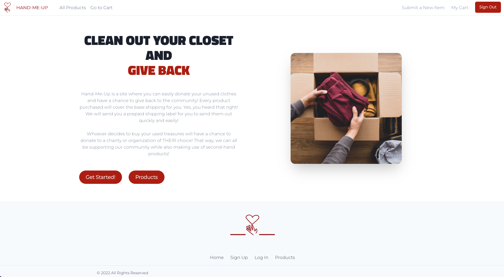
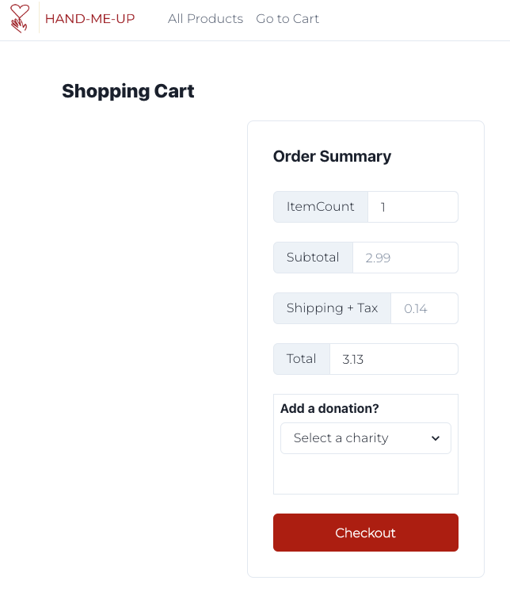

# **Hand Me Up**

_An interactive MERN Multi-Page Project_  

## **Description**

A clothing re-sale application with a purpose that reduces the stigma of accepting low-cost clothing.

Sellers list their clothing for sale at a rate that just covers shipping. Buyers can shop from a selection of low-cost but trendy and modern clothing. Buyers have the option to make an additional donation to a partner charity of their choice when making a purchase.

## **Table of Contents**

- <a href='#user-story'>User Story</a>
- <a href="#acceptance-criteria">Acceptance Criteria</a>
- <a href="#installation">Installation</a>
- <a href="#usage">Usage</a>
- <a href="#media">Media</a>
- <a href="#deployed-application">Deployed Application</a>
- <a href="contributors">Contributors</a>
- <a href="#license">License</a>

## **User Story**

### **Seller**

AS A wearer of modern clothing that is gently used, 
I WANT to donate my clothing 
SO THAT I can help lower-income families and individuals.

### **Buyer**

AS A lower-earning inidividual or family, 
I WANT affordable clothing options that are modern and gently used 
SO THAT my family and myself have adequate clothing that fits without the stigma of second-hand or low-quality clothing that will not last.

### **Seller and Buyer**

AS A buyer and seller of used clothing, 
I WANT to donate my gently used clothing to people who need affordable options and still be able to shop on the same platform 
SO THAT I can help lower-income familiar and individuals, and donate additional funds to support charities.

## **Acceptance Criteria**

- Application uses React for the front-end
- Application has a GraphQL API with a Node.js and Express.js server, and uses queries and mutations for retrieving, adding, updating, and deleting data
- Application uses MongoDB and the Mongoose ODM for the database and protects sensitive API key information on the server
- Application includes user authentication using JWT

## **Installation**

- Clone the directly from the GitHub repository to your local machine
- Run _npm i_ in the command line in the root of the application
- Run the command _npm run develop_ to launch the application

### **Tools and Required Packages**

- React App
- GraphQL
- Node.js
- Express
- MongoDB
- Mongoose ODM
- Chakra UI

## **Usage**

Upcycle and acquire gently-used clothing for a cause.

## **Media**

<a href="www.figma.com" target="_blank">Figma</a> was used for project UI design and layout. 
 

## **Deployed Application**

Deployed url: <a href='https://polar-chamber-11415.herokuapp.com/' target='_blank'>Click to access our application on Heroku</a> 
Repo url: <a href='https://github.com/olivelliott/hand-me-up' target='_blank'>Click to access our GitHub repo</a>
Demo presentation: <a href='https://docs.google.com/presentation/d/19vIb7JBm3RRtf9tKgAzRAxNrhvsD_o-ZBEU8ABAs5YQ/edit?usp=sharing' target='_blank'>Slides</a>

### **Screencapture**

**Homepage** 
 

**Products** 
 

**List an item** 
 

**My Cart** 
 

## **Contributors**

Colleen Maher 
Matt McGee 
Olivia Elliott 
Caren Merz 
Alicia McNeil

### **Authors**

The contributing authors are full-stack web developers trained at UNC Chapel Hill.

<a href="https://github.com/cpm-128" target="_blank">Colleen Maher | GitHub Profile</a> 
<a href="https://github.com/mlmcgeenc" target="_blank">Matt McGee | GitHub Profile</a> 
<a href="https://github.com/olivelliott" target="_blank">Olivia Elliott | GitHub Profile</a> 
<a href="https://github.com/cammeer" target="_blank">Caren Merz | GitHub Profile</a> 
<a href="https://github.com/aMcCode" target="_blank">Alicia McNeil | GitHub Profile</a>

## License

MIT License

View <a href='./LICENSE'>here</a>.
